## Screenshots

### 1. Docker Version
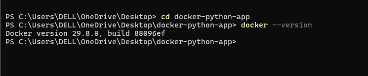

### 2. Hello World
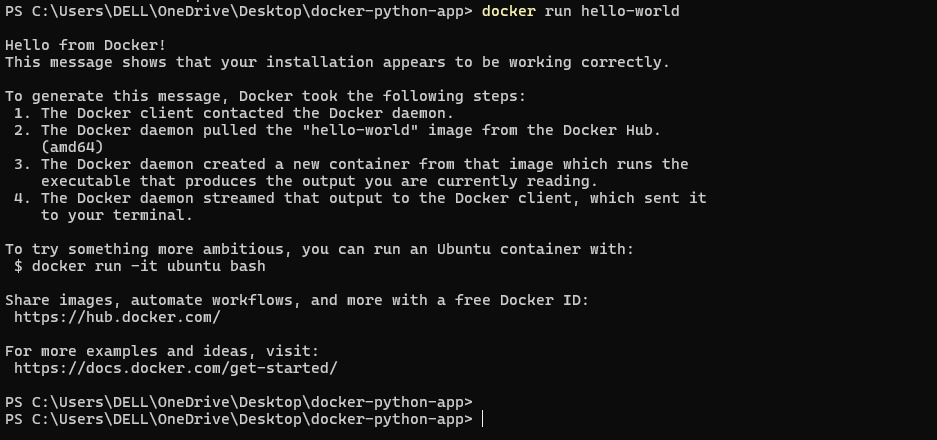

### 3. Project Folder
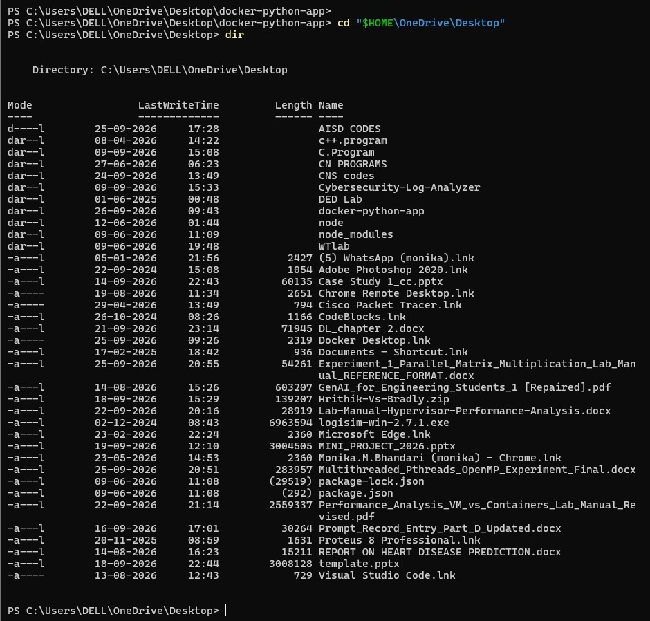

### 4. Project Files
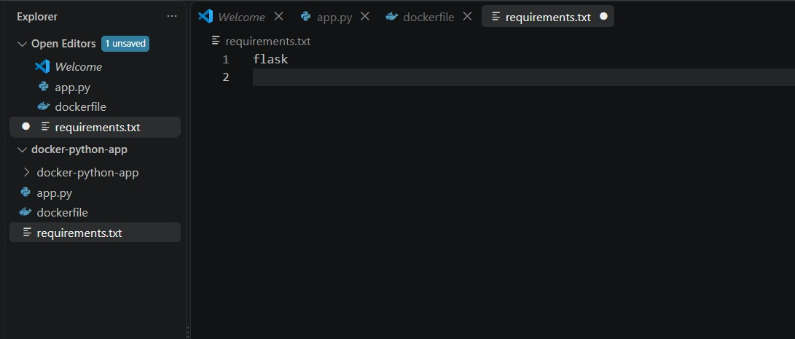

### 5. Flask Application
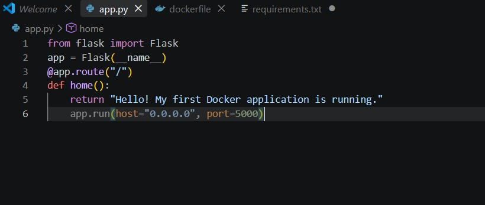

### 6. Requirements File
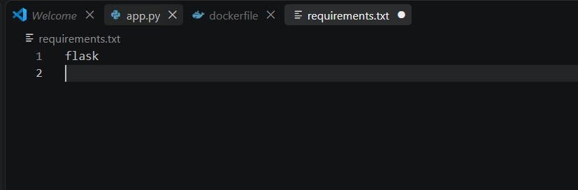

### 7. Dockerfile
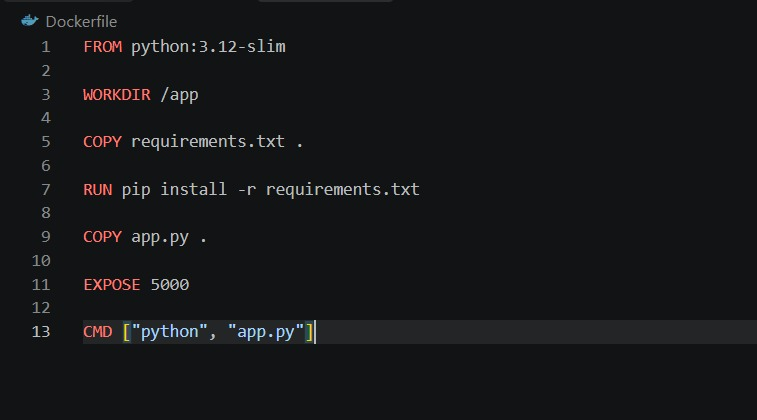

### 8. Docker Image Build
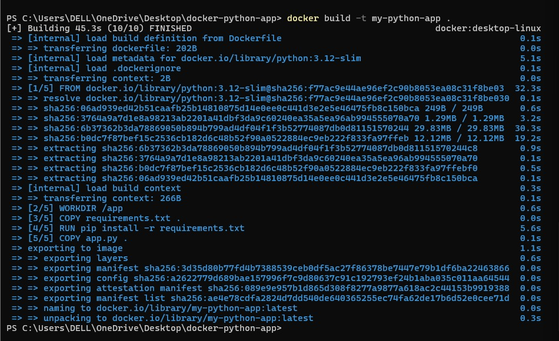

### 9. Docker Images
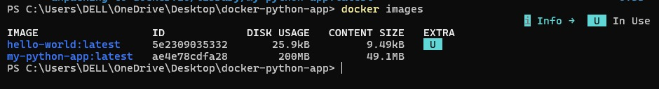

### 10. Container Created
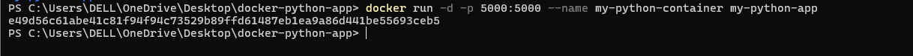

### 11. Running Container
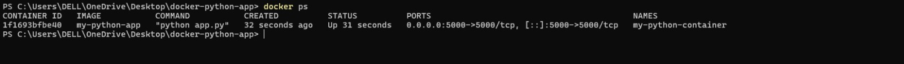

### 12. Browser Test
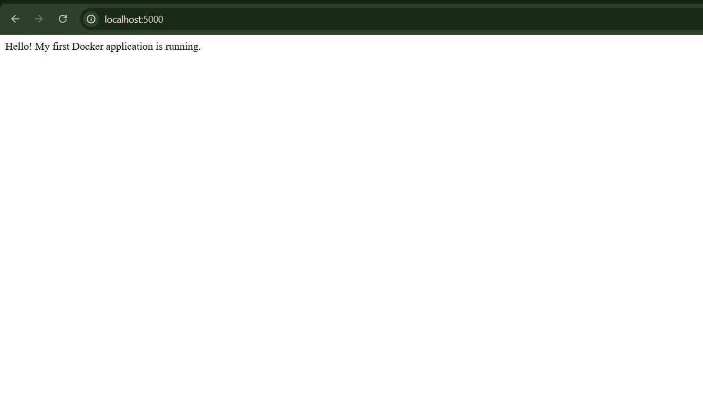

### 13. Container Logs
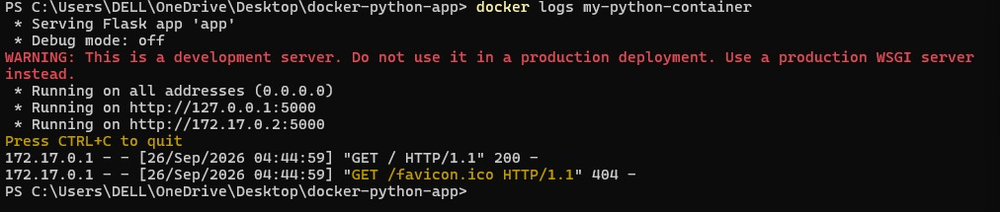

### 14. Container Started
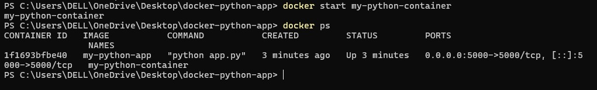

### 15. Container Removed
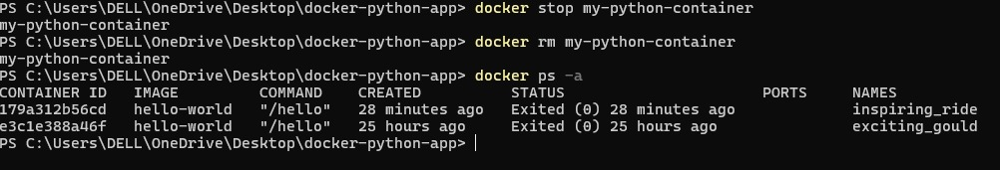

### 16. Image Remains
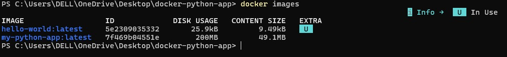
