## Screenshots

### 1. Image Check
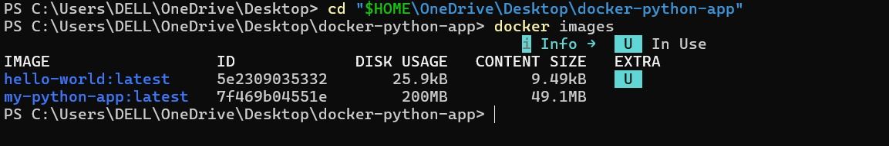

### 2. Container Created
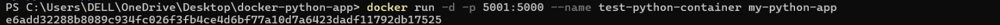

### 3. Docker PS
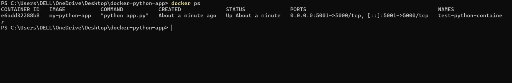

### 4. Browser Test
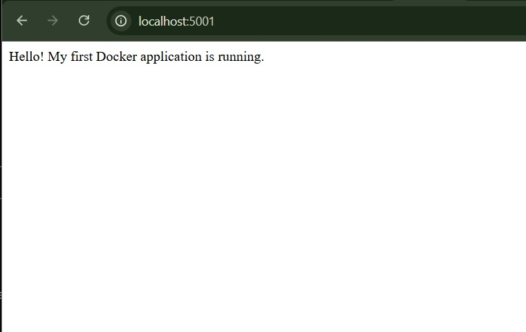

### 5. Container Logs
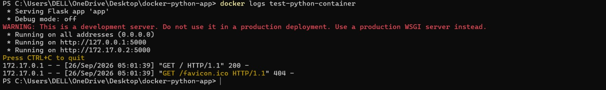

### 6. Docker Inspect
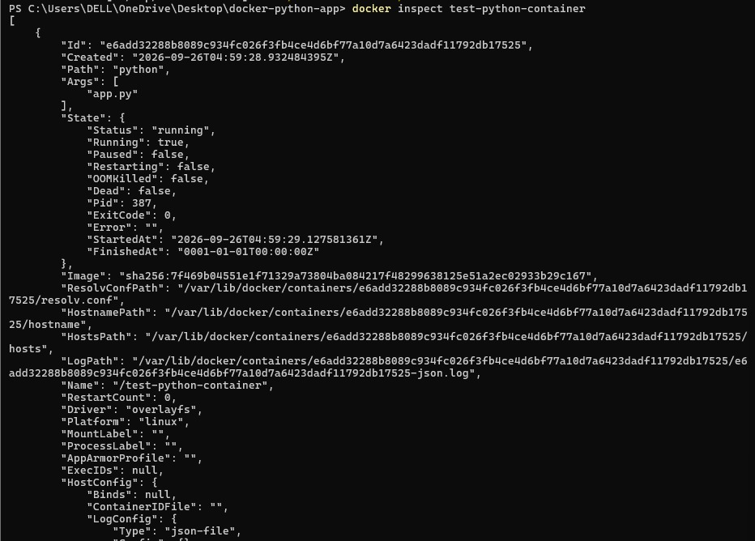

### 7. Container Shell
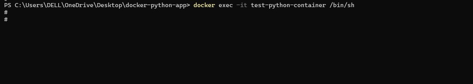

### 8. Container Files
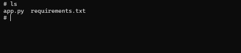

### 9. Container Stopped
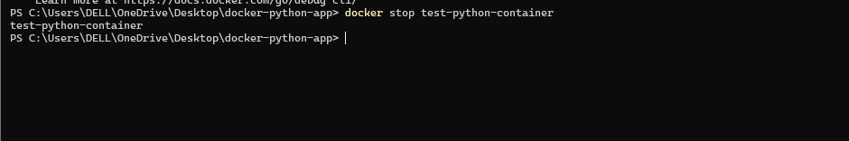

### 10. Stopped Container List
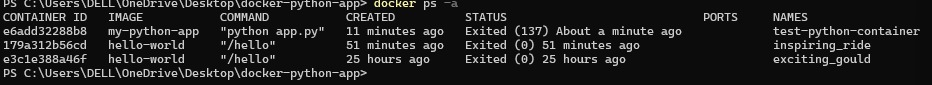

### 11. Container Started
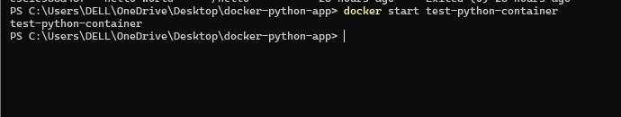

### 12. Container Running Again
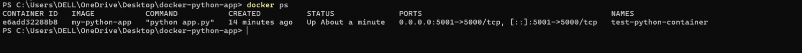

### 13. Same Container ID
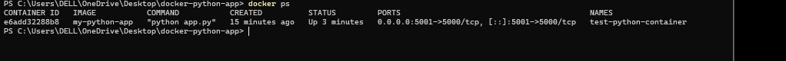

### 14. Container Removed
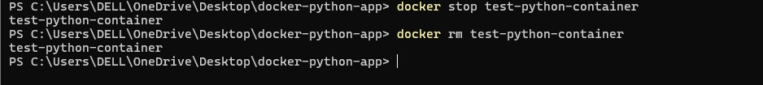

### 15. Image Still Exists
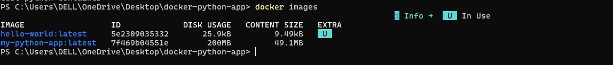
