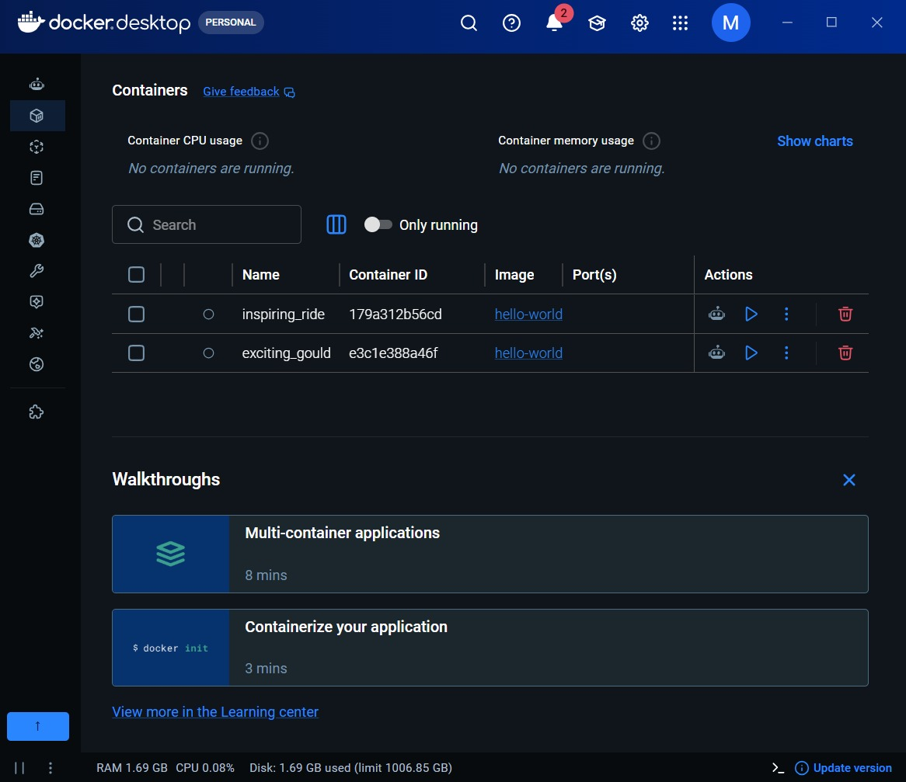
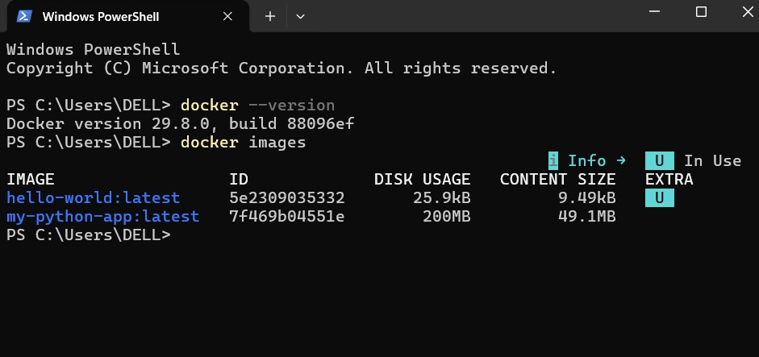
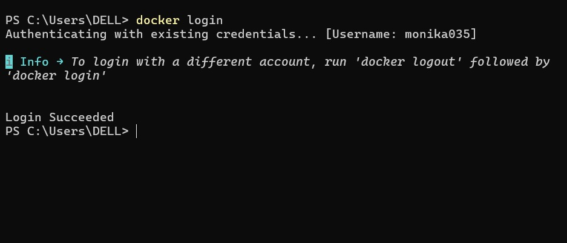
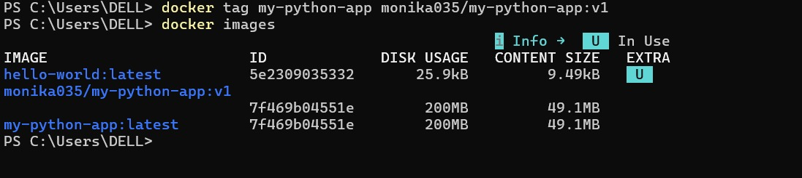
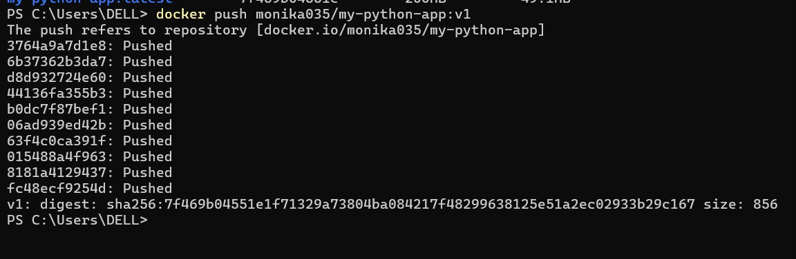
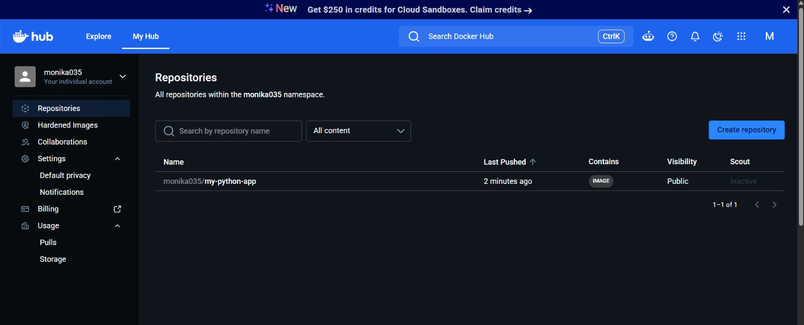
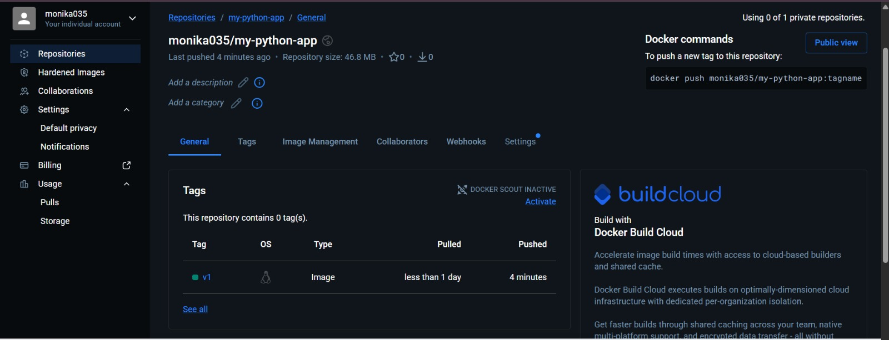

## OUTPUTS

### 1. Docker Desktop

### 2. Existing Docker Image

### 3. Docker Hub Login

### 4. Docker Image Tagged

### 5. Docker Image Push

### 6. Docker Hub Repository

### 7. Docker Hub v1 Tag

