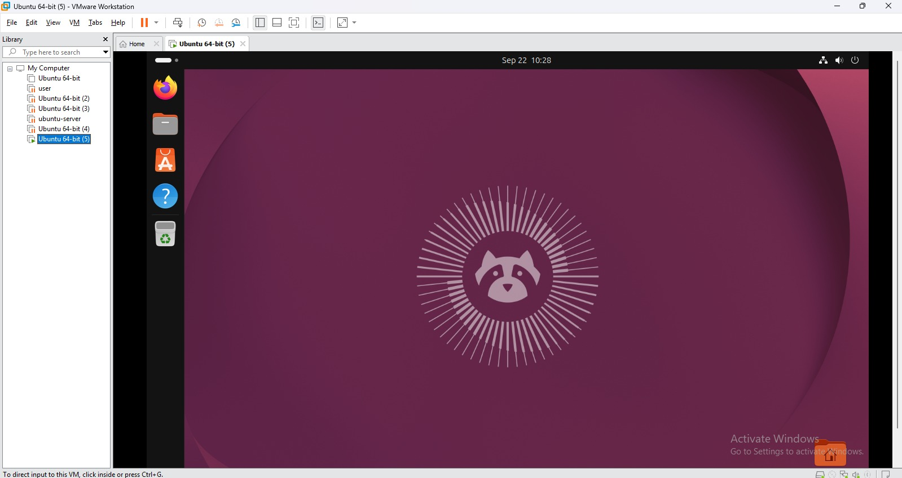
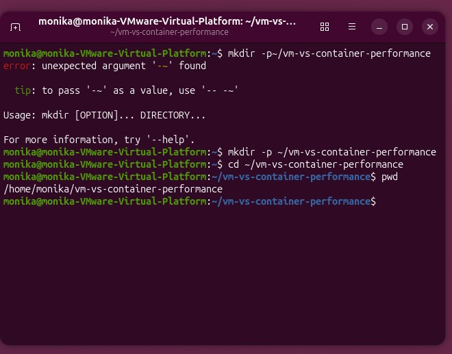
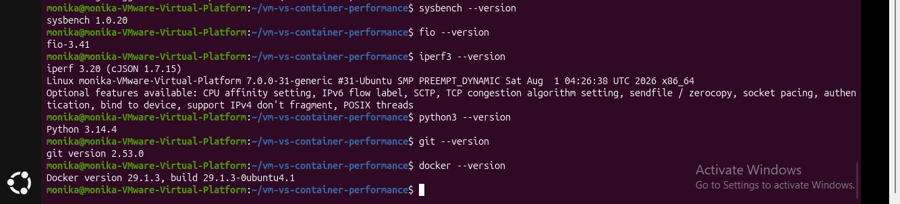
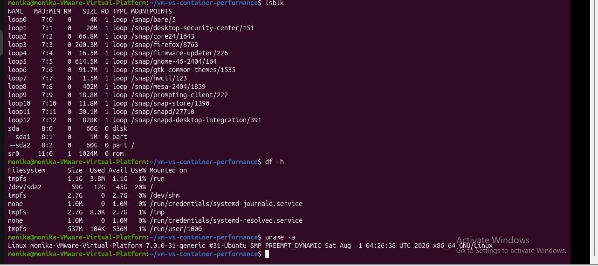
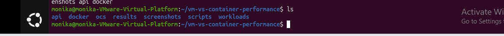
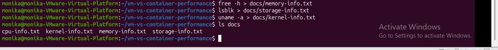
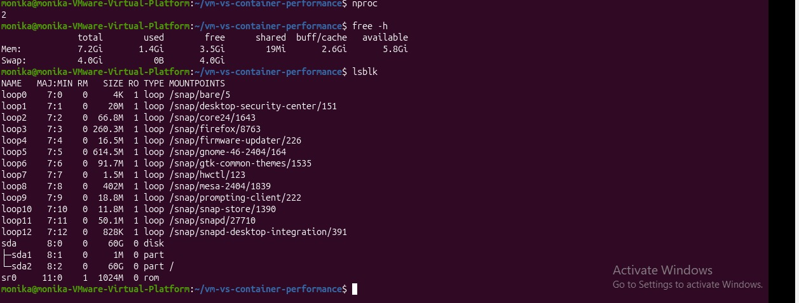
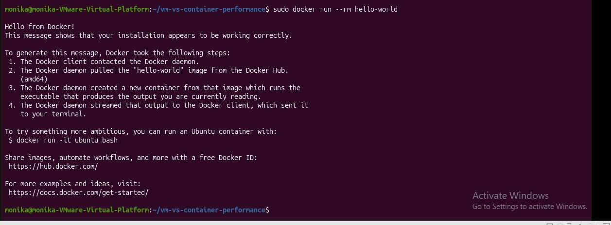

# Experiment 2 Screenshots

## 1. Ubuntu Running

## 2. PWD Output

## 3. Installed Software

## 4. Hardware Information

## 5. Project Structure

## 6. LS Documents

## 7. Configured Resources Received by Ubuntu

## 8. Docker Working

